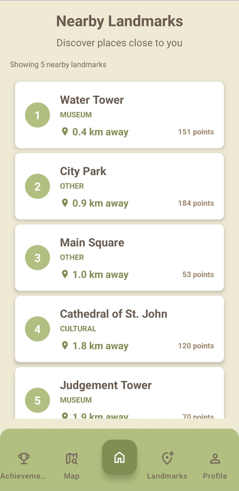
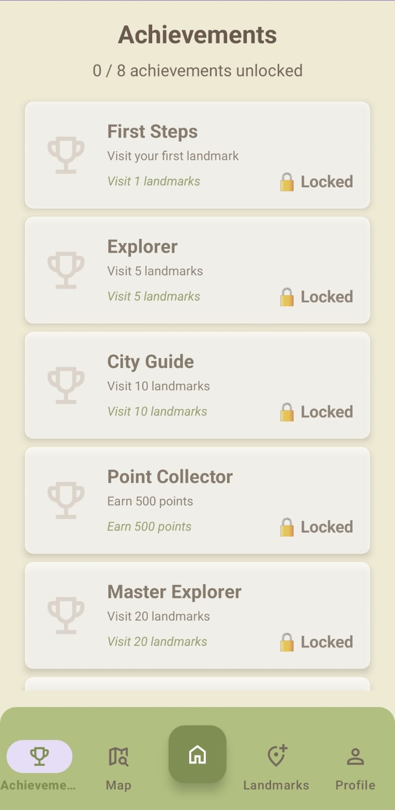
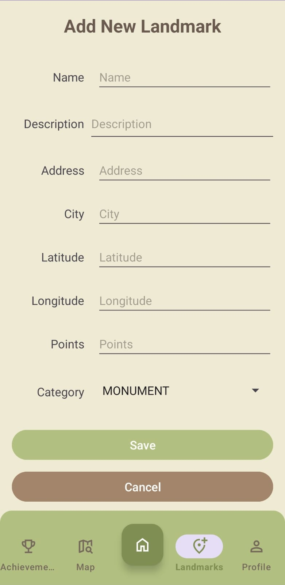
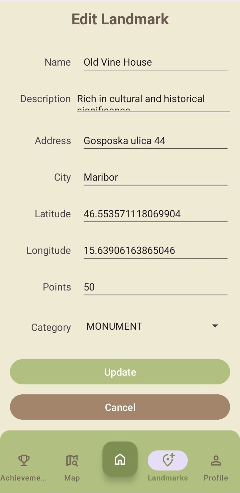
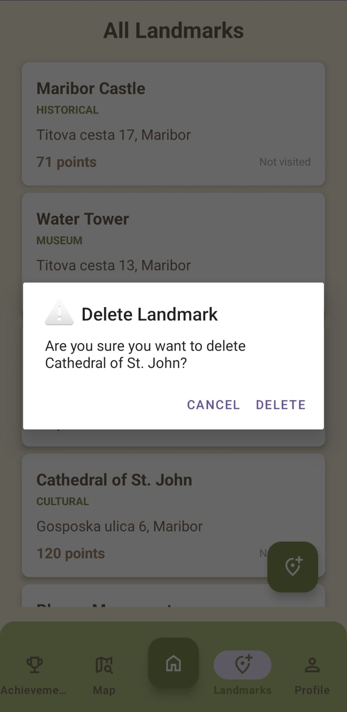
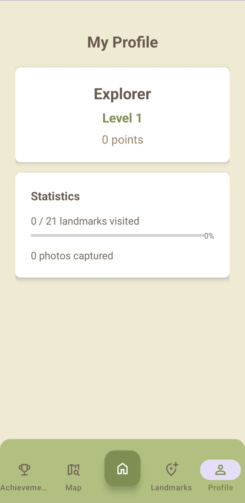

# 📸 SlikniSi

SlikniSi is an Android application designed to encourage users to
explore their surroundings through photography. The app highlights
popular landmarks on an interactive map, allows users to capture photos
of these locations, and rewards them with points that contribute to
their profile level.

> *This application is developed as part of the subject PORA.*

------------------------------------------------------------------------

## ✨ Purpose of the Application

SlikniSi is intended for both tourists and locals who want to:

-   Discover scenic and iconic spots within a city\
-   Photograph marked landmarks\
-   Collect points by visiting and capturing locations\
-   Track progress and level up their profile\
-   Build a personal gallery of meaningful captured moments

The app combines exploration, geolocation features, and gamification
into a modern and visually engaging experience.

------------------------------------------------------------------------

## 👨‍💻 Author

**Mihail Trajkoski**

------------------------------------------------------------------------

## 🗺️ Key Features (Planned)

-   Interactive map with marked landmarks (OpenStreetMap)\
-   Point system and user level progression\
-   Capture and store photos for visited locations\
-   GPS location validation to confirm proximity\
-   Push notifications (e.g., daily challenges, new landmarks)\
-   Multi-language support (e.g., English, Slovenian)\
-   Local storage of user data and preferences\
-   Display of visited locations and achievements

------------------------------------------------------------------------

## 🛠️ Technologies Used

### **Android & Kotlin Technologies**

-   Android Studio\
-   Kotlin\
-   ConstraintLayout\
-   ViewBinding\
-   SharedPreferences\
-   Application class for global state\
-   Kotlinx.serialization or Gson for `.json` data storage\
-   RecyclerView for displaying lists\
-   Kotlin-faker\
-   UUID generation for unique object/user identification\
-   registerForActivityResult for passing data between activities

### **Higher-Level Functionalities**

-   OpenStreetMap SDK\
-   Push Notifications (Firebase Cloud Messaging or
    NotificationManager)\
-   Camera & MediaStore for capturing photos\
-   Haptic feedback\
-   Optional QR code functionality

------------------------------------------------------------------------

## 🎨 Planned UI & Design Features

-   Custom app theme and color palette\
-   Use of vector graphics (.svg)\
-   Custom font for titles or UI elements\
-   Multi-language string resources (`strings.xml`)\
-   Well-structured dimension resources (`dimens.xml`)

------------------------------------------------------------------------

## 📷 Screenshots

### Home Page

*Nearby landmarks sorted by distance*

### Achievements

*Track progress and unlock achievements*

### Map

*Map integration (coming soon)*

### All Landmarks

*Complete list of landmarks with details*

### Add Landmark

*Form for adding new landmarks*

### Edit Landmark

*Edit existing landmark details*

### Delete Landmark

*Confirmation before deletion*

### Profile

*User statistics and progress*
